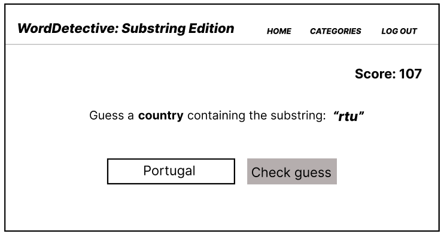

# WordDetective: Substring Edition

## Intended use

WordDetective: Substring Edition is intended to be both a resource for learning and a brainteaser for those wishing to challenge their vocabulary.
 
 
The completed application will serve two versions of users: registered users and guest users.
The guest users can only choose among the default, previously implemented wordlists.
The registered user will be able to upload personalized wordlists, and thereby be able to play additional categories.
The registered users will also have their scores stored to persistent memory, so they can continue where they left off.
 
Once the user has chosen a category among the respective available categories, the game begins.
Words will be pulled randomly out of the wordlist correlating to the category, and the user will be presented with a substring from this word. The user must then guess a word which contains the provided substring as a substring, in addition to being present in the wordlist. Correct guesses increase the score. Registered users will get this score stored to persistent memory, so they can continue to build their score later on.

## Screenshot

 
_This is only a tentative UI. The current release has a different UI. Future releases will have improved UI and UX._

## Userstories

This section contains user stories intended to unravel the needs of the application.
 

### Studying for test (us-1)

"As i student, i want to test and expand my vocabulary within certain topics".

#### _important for UI_

- Intuitive section for adding categories.
- Intuitive section for seeing all personally added categories.

#### _important for functionality_

- Simple way of adding the categories, such as directly uploading file.
  - Could support upload of various file formats to make it simpler for user. Could then implement script for converting to desired persistent storage.
