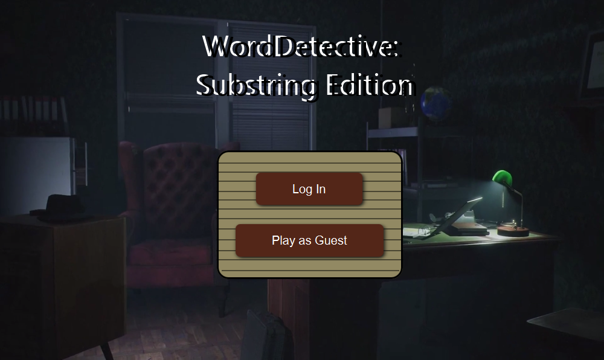

# WordDetective: Substring Edition
WordDetective: Substring Edition is intended to be both a resource for learning and a brainteaser for those wishing to challenge their vocabulary.

The main objective of the game is to write words containing the substring given by the game. For example: If you play the category "Fruits" and the substring is *PL* a correct solution can be Apple.

The application comes with default categories, but you can also create your own custom categories.

 
_This is only a tentative UI. The final product may look different._

