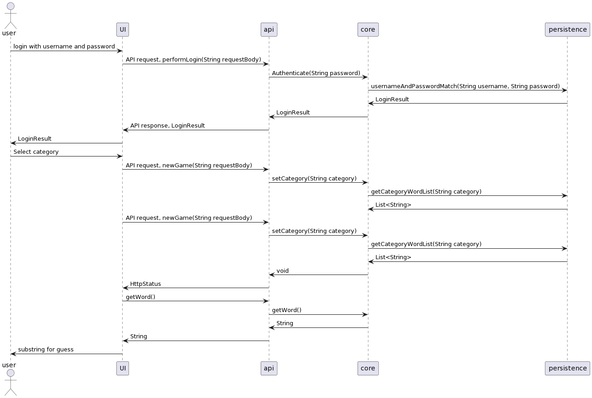

# WordDetective: Substring Edition - release 3

This is the third and final release of "WordDetective: Substring Edition".
In this release, we have focused on building a REST API for the core logic, as well as further developing our JavaFX application. The JavaFX application has been supplemented with more functionality (which will be explained in detailed later in this document), and the quality of the code has been improved by thorough code reviews and improved test coverage. It's also worth mentioning that we have created a few new modules (for example the api module), to separate the functionality of the program.
Furthermore, we have continued with the work routines from the previous releases. This includes the use of a milestone, issueboard with issues, separate brances for various imlpementations, pair-coding, and code reviews in the merge requests.

The requirements for the third release have been fulfilled in the following manner:

- **Architecture**

  We have created a REST API using Spring Boot. The api has been granted it's own module, namely the "api" module. The api module contains a variety of controller classes, which listens for incoming requests. Once a controller in the API module receives a request, it delegates the task associated with the respective API endpoint to the correlating method in the core module.
  Additionally, we have modified the UI controller classes to solely rely on the API module for access to the core functionality. Thus, every interaction between the UI module and the core module now goes via the api.

- **Functionality**

  - _New functionality from previous release_

    We have chosen to further develop our JavaFX application.
    Since the previous release, we have implemented:

    - Easy upload and deletion of custom categories (only for registered users)

      Registered users are now able to upload their own custom categories. This feature is visible in the category page, where the user is able to paste in all the words making up the wordlist, as well as give the category a name. The wordlist will then be stored persistently to the user's json file. The user also has the delete their custom categories by simply pressing the "x" button next to the category in the categoy selector.

    - Navigation features

      We received feedback that the program lacked a way to navigate to previous scenes.
      For example, once the user had chosen a category and was sent into a game, there was no possibility to go back to the category page to select a different category. We have now implemented this feature, in the form of a "go-back-button" in the top left corner of all scenes.

    - In-game "game-over-timer-indicator"

      From the start, we planned to give the user a certain amount of time to guess the correct word, or else the game would end. Initially, we thought of having a simple timer displaying this remaining time. However, for a more entertaining user experience, we implemented this "game-over-timer-indicator" as the substring falling down towards the user, and if the substring reaches the user, the game is over.

    - Updated user interface

      The user interface now displays an intriguing background video, as well as a catchy tune.

    - Information pane in category page

      For first time user's the purpose of choosing categories may not be clear. Thus, we have implemented a pane in the category page which gives information regarding what the purpose of choosing a category is.

    - Hidden word showcased on gameover

      If you were not able to find out what word the substring was apart of you can now see what the hidden word was.

  - _Use of the API_

    As mentioned in the "Architecture" section, we have created an API which encapsulates the core functionaliy. Thus, when the user interacts with the UI, and there is a demand for information from the core functionality, the UI module sends a HTTP request to the API, which in turn delegates the task to the core module.

  - _Maven commands_

    We have continued with maven commands for this program.
    In addition to the previously used maven commands, we have also introduced a command to spin up the web server: `mvn -f pom.xml spring-boot:run`

  - _Tests and code quality_

    For code quality, we have continued using checkstyle and spotbugs. In addition to these tools, we have conducted thorough code reviews on each and every merge request. The merge requests which did not satisfy the code review received threads, which had to be resolved before the merge request was approved.

- **Work routines**

  As with the previous releases, we started this release with a milestone. Then, we created an issueboard for the milestone. From there, we created an issue for every task we had to complete in order to end up with our desired program. We also used labels in the issues to showcase what type of issue it was, maybe it was a update, a fix or maybe an annoying bug. The labels also descriped what type of priority the issue had, or maybe it was just an implementation suggestion? Before we started on an issue, we created a separate branch to solve the issue on. We primarily worked in pairs on the issues, and documented each added feature with a commit (with an appropriate commit message). Once we were satisfied with the code, we submitted a merge request. The group members which had not been involved with the respective issue conducted a code review on the merge request, to make sure the code held up to our standards. If the code reviewers deemed the code to satisfy our standars, the merge request was marked as approved, and it would be merged. Otherwise, the code reviewers would mark the code they disagreed with using threads, whereas these threads had to be resolved before the merge request was approved.

- **Documentation**

  - _Documentation of REST server_

    We created the API to implement the basic CRUD (create, read, update, delete) operations.
    The REST server thus supports HTTP POST, GET, PUT, and DELETE requests.
    We have used the mentioned request formats according to their intended purposes;
    POST requests to send data to the server, GET requests to read/retrieve data from the server, PUT requests to modify data on the server, and DELETE to delete data on the server.

  - _Class diagram_

    A class diagram, highlighting the most central parts of the application. These classes were chosen because they represent the core logic of what happens on the backend.
    

  - _Sequence diagram_

    Sequence diagram showcasing the logic behind the login-operation and selection of category.
    

  - _Package diagram_

    Package diagram showing the modules dependencies.
    
